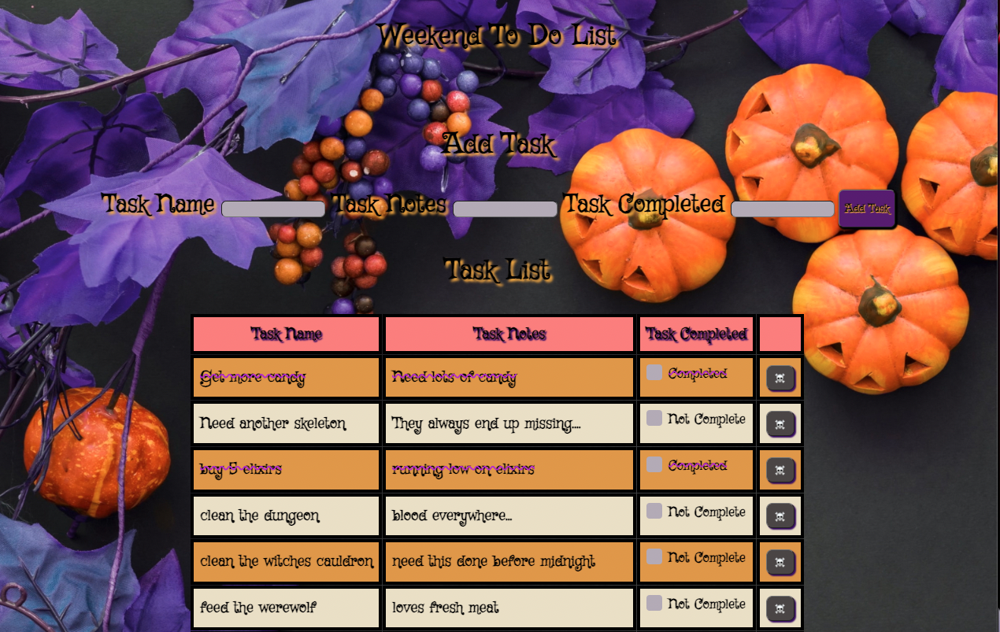

## Project Name

# Weekend Sql To Do List (Halloween Theme)

## Description

_Duration: 13 hours_

This project was a lot of fun especially with adding a Halloween theme to it.

I made a tasks-to-do list that utilizes the client, server, and a SQL database. This allows you to add a task, mark them as completed, and gives you the ability to permanetely delete the task from your database. 

I've also added a sweet alert that provides a prompt to confirm whether you would like to delete or keep the specific task item.

## Screen Shot

 
## Prerequisites 

- PostgresSQL
- Postico (SQL editor)
- Node
- Express 

## Database Setup

You'll also need a database. 

The project is built on [Postgres](https://www.postgresql.org/download/), so you will need to make sure to have that installed. We recommend using Postico to run those queries as that was used to create the queries. 

## Installation

1. To install, click the green `code` button at the top this page. Fork and clone this repo.

2. Open the project in a code editor of your choice and run the following command `npm install` in the terminal. 

3. Create a database named `weekend_to_do_app`

4. The queries in the `database.sql` file are set up to create all the necessary tables and populate the needed data to allow the application to run correctly.

5. Run `npm start` in your terminal.

6. Then, open your browser and visit http://localhost:5000/

## Usage 

1. Fill in the task name, task note, and task completed.

2. Click, `Add Task` and the task will be added to the Task List.

3. Once a task has been completed, click the box next to `Incomplete`. This will change the incomplete to `Completed`, as well as add a line-through on the text.

4. If you no longer need the task on your list, click the `Delete` button and this will permanetely remove the task from the database/list.

## Built With 

- PostgresSQL
- Postico (SQL editor)
- Node
- Express 
- Jquery
- JavaScript
- CSS
- HTML

## Acknowledgement 

Thanks to [Prime Digital Academy](www.primeacademy.io) who equipped and helped me to make this application a reality. (Thank you, Prime!)
